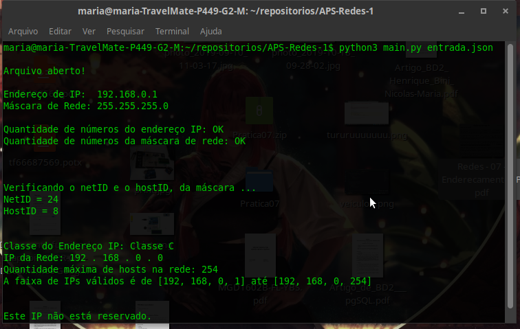

# APS de Redes de Computadores 1
# Programa de Cálculo de Rede
APS com objetivo do melhor aprendizado sobre IPs dentro da matéria Redes de Computadores 1 do professor Luiz Arthur, 2019/2.

## Como executar o programa:
É só ter o Python versão 3 ou mais recente e executar o comando:
### `python3 main.py arquivo.json`

O programa executa as seguintes funções pedidas pelo professor:
- a) Verificar se IPs e máscaras são válidas.
- b) Quantidade de bits da rede (netID) e quantidade de bits de host (hostID), da máscara.
- c) Classe do IP.
- d) IP da rede.
- e) IP de broadcast.
- f) Quantidade de hosts na referida rede.
- g) Faixa de máquinas válidas - que podem ser utilizadas pelos hosts.
- h) Se o IP é em questão é reservado (privado, loopback, etc).
- i) Apresentar a saída, referente as questões anteriores: (i) na tela e (ii) em um arquivo
JSON. O nome dos campos no arquivo JSON devem ser intuitivos.